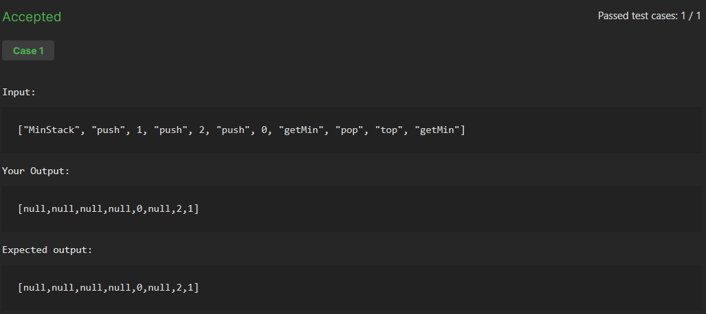

# Minimum Stack
## Difficulty - Medium

Design a stack class that supports the `push`, `pop`, `top`, and `getMin` operations.

`MinStack()` initializes the stack object.
`void push(int val)` pushes the element `val` onto the stack.
`void pop()` removes the element on the top of the stack.
`int top()` gets the top element of the stack.
`int getMin()` retrieves the minimum element in the stack.
Each function should run in **O(1)** time.

Example 1:
```python
Input: ["MinStack", "push", 1, "push", 2, "push", 0, "getMin", "pop", "top", "getMin"]

Output: [null,null,null,null,0,null,2,1]

Explanation:
MinStack minStack = new MinStack();
minStack.push(1);
minStack.push(2);
minStack.push(0);
minStack.getMin(); // return 0
minStack.pop();
minStack.top();    // return 2
minStack.getMin(); // return 1\
```
Constraints:
- `-2^31 <= val <= 2^31 - 1`.
- `pop`, `top` and `getMin` will always be called on non-empty stacks.

# Code Solution:
```python
class MinStack:
    
    def __init__(self):
        self.stack = []
        self.min_stack = []

    def push(self, val: int) -> None:
        self.stack.append(val)
        if not self.min_stack:
            self.min_stack.append(val)
        elif val <= self.min_stack[-1]:
            self.min_stack.append(val)

    def pop(self) -> None:
        if self.stack[-1] == self.min_stack[-1]:
            self.min_stack.pop()
        self.stack.pop()

    def top(self) -> int:
        return self.stack[-1]

    def getMin(self) -> int:
        if not self.min_stack:
            return False
        else:
            return self.min_stack[-1]
```


- Each operation runs in O(1) time (push/pop/top/getMin).
- Space is O(n) in the worst case because stack holds all values and min_stack can also hold up to n entries when values are strictly decreasing.

I am pretty Happy with this solution it is definitely one of the easier Medium I have done and my solution is almost Identical to the NeetCode Solution so I am happy with it.