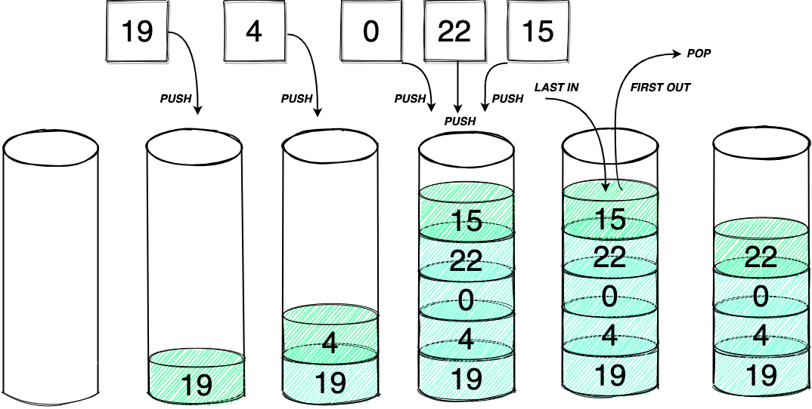

# Stacks

Stacks is a Data Structure used in programming. It follows a very simple rule known as **Last in First Out(LIFO)**.



## Operations:
Stacks have 3 main operations
### 1. Push
- This is when you push a new element to the top of the stack,
### 2. Pop 
- This is when you remove the topmost value from the stack.
### 3. Peek
 - This is when you get the topmost value in the stack. What is the value at the top.

Now what makes stacks so strong is that all of these operations are done in **O(n)** run time. Also in python unlike in C or other low-level languages. In order to initialize a stack in python we just set it as an empty array. **stack = [ ]**.

## Scenarios:
Here are some use cases in which you might need to implement a stack.

1. Matching/validating parentheses or brackets — need last-opened bracket to be closed first (LIFO).
2. Nested structures that must close in order — e.g., HTML/XML tags, arithmetic expressions; enforce correct nesting.
3. Manual calculation with order of operations — evaluate expressions by pushing numbers/operators and resolving in precedence/stack order.
4. Undo/history functionality — last action visited is the first to roll back (backtracking, editor undo, browser back).

# Practice Coding Example:
## 20. Valid Parentheses
### Difficulty - Easy

Given a string s containing just the characters `'('`, `')'`, `'{'`, `'}'`, `'['` and `']'`, determine if the input string is valid.

An input string is valid if:

1. Open brackets must be closed by the same type of brackets.
2. Open brackets must be closed in the correct order.
3. Every close bracket has a corresponding open bracket of the same type.
 
Example 1:

`Input: s = "()"`

`Output: true`

Example 2:

`Input: s = "()[]{}"`

`Output: true`

Example 3:

`Input: s = "(]"`

`Output: false`

Example 4:

`Input: s = "([])"`

`Output: true`

Example 5:

`Input: s = "([)]"`

`Output: false`

```python
class Solution(object):
    def isValid(self, s):
        """
        :type s: str
        :rtype: bool
        """
        if not s:
            False
        
        stack = []

        for par in s:
            if par == '(' or par == '[' or par == '{':
                stack.append(par)
            else:
                if par == ')':
                    if not stack: return False
                    else:
                        if stack.pop() == '(':
                            continue
                        else: return False
                if par == ']':
                    if not stack: return False
                    else:
                        if stack.pop() == '[':
                            continue
                        else: return False
                if par == '}':
                    if not stack: return False
                    else:
                        if stack.pop() == '{':
                            continue
                        else: return False

        
        return True if not stack else False """
```
### Other solution
```python
class Solution:
    def isValid(self, s: str) -> bool:
        stack = []                                     # holds open brackets in LIFO order
        closeToOpen = { ")": "(", "]": "[", "}": "{" } # map closing → matching opening

        for c in s:
            if c in closeToOpen:                       # if we see a closing bracket
                if stack and stack[-1] == closeToOpen[c]:  # top of stack matches expected opener
                    stack.pop()                        # close the pair
                else:
                    return False                       # mismatch or nothing to close
            else:
                stack.append(c)                        # push opening bracket

        return True if not stack else False            # valid only if no unmatched openers remain

```
- Time complexity: O(n)
- Space complexity: O(n)

## More Advanced Stacks

### Monotonic Stacks:
- **Types:** Monotonic decreasing stack (top smallest) to find next greater; monotonic increasing stack (top largest) to find next smaller.
- **How:** Iterate once; while the current value breaks the stack’s order, pop and resolve queries for the popped index (e.g., set its next greater to current). Then push the current index/value.
- **Why use indices:** You often store indices so you can write results into an output array and still access values via the original list.
- **Complexity:** Each element is pushed/popped at most once → `O(n)` time, `O(n)` space for the stack.
- **Common problems:** Next Greater Element, Daily Temperatures, Stock Span, Trapping Rain Water (using decreasing stack of heights), Largest Rectangle in Histogram (increasing stack of bars).
- Monotonic **decreasing** (values drop as you go up the stack): good for finding the next greater element, daily temperatures, stock span.
- Monotonic **increasing** (values rise as you go up the stack): good for finding the next smaller element, largest rectangle in histogram, certain min-boundary problems.
